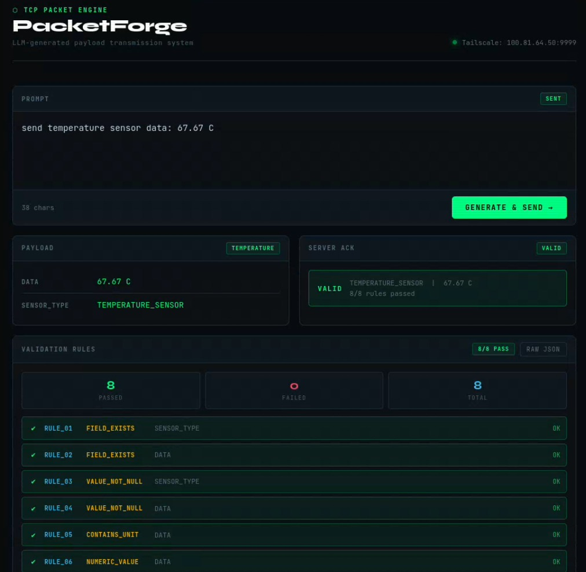
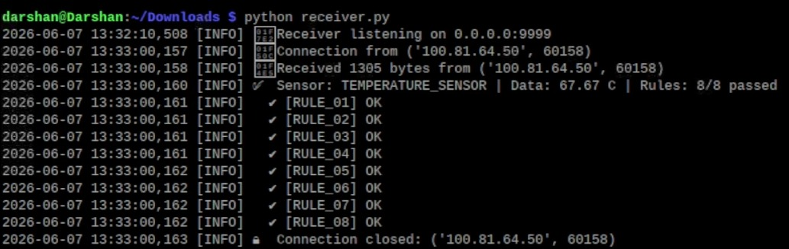

# PacketPI

**LLM-powered custom packet generation and validation system for protocol testing.**

## Problem Statement

Network protocols rely on correctly formatted packets to function as intended. Manually constructing packets to test protocol behavior is error-prone, tedious, and does not scale across diverse sensor types and validation scenarios. This project solves that problem by using a local LLM to convert natural-language descriptions into structured, self-validating TCP packets — enabling rapid, flexible protocol testing without hand-crafting payloads.

## How It Works

```
User (via Web UI or API)
    │  POST /generate  {"prompt": "temperature 27.4 C"}
    ▼
┌─────────────────────┐      ┌──────────────────┐
│   sender.py          │─────►│   Ollama LLM      │
│   (Flask server)     │◄─────│   (packet-gen1)    │
│                      │      └──────────────────┘
│   1. Sends prompt    │
│   2. LLM returns     │
│      JSON packet     │
│      with rules      │
│   3. Forwards over   │─────►┌──────────────────┐
│      TCP             │      │   receiver.py     │
│   4. Receives ACK    │◄─────│   (TCP server)    │
└─────────────────────┘      │   Validates       │
                              │   Returns ACK     │
                              └──────────────────┘
```

Each generated packet is **self-validating** — it carries both the payload (e.g., sensor type and reading) and a set of validation rules that the receiver applies to verify correctness. This ensures the protocol handles data integrity, type checking, range validation, and format conformance automatically.

## Screenshots

| Sender UI | Receiver UI |
|---|---|
|  |  |

## Features

- **Natural language → structured packet:** Describe what you want to send in plain English; the LLM generates the packet
- **Self-contained validation rules:** Every packet defines its own correctness criteria (field existence, numeric ranges, unit matching, regex patterns, etc.)
- **8 validation check types:** `FIELD_EXISTS`, `VALUE_NOT_NULL`, `EXACT_MATCH`, `CONTAINS_UNIT`, `NUMERIC_VALUE`, `RANGE_CHECK`, `REGEX_MATCH`, `FORMAT_CHECK`
- **Cyberpunk-styled web UI:** Browser interface for composing prompts and viewing payloads, rules, and ACK results in real time
- **TCP over Tailscale:** Secure device-to-device communication between laptop and Raspberry Pi
- **Deterministic LLM output:** Low-temperature (`0.1`) model configuration ensures consistent, predictable packet generation

## Architecture

| Component | File | Role |
|---|---|---|
| Web UI | `sender.html` | Browser frontend for prompt entry and result display |
| Sender | `sender.py` | Flask API server that queries Ollama and forwards packets over TCP |
| Receiver | `receiver.py` | TCP server that validates incoming packets and returns structured ACKs |
| Model Config | `Modelfile` | Ollama model definition (`packet-gen1` based on `qwen2.5-coder:1.5b`) |

## Getting Started

### Prerequisites

- Python 3.x with `flask`, `flask_cors`, `requests`
- [Ollama](https://ollama.com/) running locally
- Tailscale (for laptop → Raspberry Pi communication)

### Setup

1. **Create the custom Ollama model:**
   ```bash
   ollama create packet-gen1 -f Modelfile
   ```

2. **Start the receiver** (on the Raspberry Pi):
   ```bash
   python receiver.py
   ```

3. **Start the sender** (on the laptop):
   ```bash
   python sender.py
   ```

4. **Open the UI:** Navigate to `http://localhost:5000` or open `sender.html` directly.

5. **Send a packet:** Type something like _"send temperature sensor data 27.4 C"_ and click **Generate & Send**.

## Configuration

| Parameter | Default | Description |
|---|---|---|
| Ollama endpoint | `http://localhost:11434/api/generate` | Local LLM API |
| Model | `packet-gen1` | Custom Ollama model |
| Receiver address | `100.117.250.88:9999` | Tailscale IP + port |
| Socket timeout | 10 seconds | TCP send/receive timeout |
| Receiver buffer | 65,536 bytes | Max incoming packet size |
| LLM temperature | `0.1` | Deterministic output |

## Use Cases

- **Protocol prototyping:** Quickly generate test packets with varying payloads and validation rules
- **IoT sensor simulation:** Emulate diverse sensor readings (temperature, humidity, pressure, etc.) without physical hardware
- **Edge case testing:** Craft packets with intentionally malformed data to verify receiver robustness
- **Educational demonstrations:** Show how LLMs can augment traditional networking and protocol testing workflows
